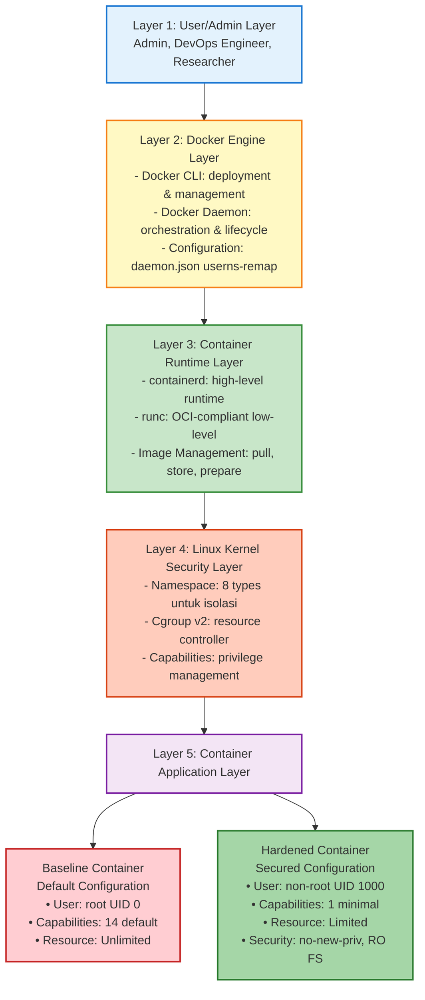

```mermaid
flowchart TD
    A["Layer 1: User/Admin Layer<br/>Admin, DevOps Engineer, Researcher"]
    B["Layer 2: Docker Engine Layer<br/>- Docker CLI: deployment & management<br/>- Docker Daemon: orchestration & lifecycle<br/>- Configuration: daemon.json userns-remap"]
    C["Layer 3: Container Runtime Layer<br/>- containerd: high-level runtime<br/>- runc: OCI-compliant low-level<br/>- Image Management: pull, store, prepare"]
    D["Layer 4: Linux Kernel Security Layer<br/>- Namespace: 8 types untuk isolasi<br/>- Cgroup v2: resource controller<br/>- Capabilities: privilege management"]
    E["Layer 5: Container Application Layer"]
    
    F["Baseline Container<br/>Default Configuration<br/>• User: root UID 0<br/>• Capabilities: 14 default<br/>• Resource: Unlimited"]
    G["Hardened Container<br/>Secured Configuration<br/>• User: non-root UID 1000<br/>• Capabilities: 1 minimal<br/>• Resource: Limited<br/>• Security: no-new-priv, RO FS"]
    
    A --> B
    B --> C
    C --> D
    D --> E
    E --> F & G
    
    style A fill:#e3f2fd,stroke:#1976d2,stroke-width:2px
    style B fill:#fff9c4,stroke:#f57f17,stroke-width:2px
    style C fill:#c8e6c9,stroke:#388e3c,stroke-width:2px
    style D fill:#ffccbc,stroke:#d84315,stroke-width:2px
    style E fill:#f3e5f5,stroke:#7b1fa2,stroke-width:2px
    style F fill:#ffcdd2,stroke:#c62828,stroke-width:2px
    style G fill:#a5d6a7,stroke:#2e7d32,stroke-width:2px
```
