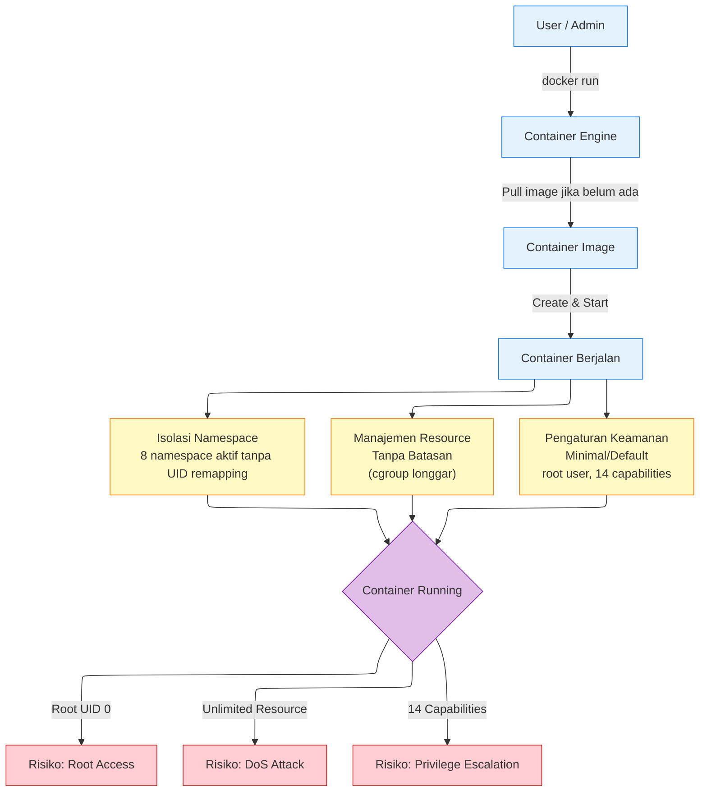

```mermaid
---
config:
  layout: elk
---

flowchart TD
    A[User / Admin]
    B[Container Engine]
    C[Container Image]
    D[Container Berjalan]
    E["Isolasi Namespace<br/>8 namespace aktif tanpa UID remapping"]
    F["Manajemen Resource<br/>Tanpa Batasan<br/>(cgroup longgar)"]
    G[Pengaturan Keamanan<br/>Minimal/Default<br/>root user, 14 capabilities]
    H{Container Running}
    I[Risiko: Root Access]
    J[Risiko: DoS Attack]
    K[Risiko: Privilege Escalation]

    A --> |docker run| B
    B --> |Pull image jika belum ada| C
    C --> |Create & Start| D

    D --> E
    D --> F
    D --> G

    E --> H
    F --> H
    G --> H

    H --> |Root UID 0| I
    H --> |Unlimited Resource| J
    H --> |14 Capabilities| K

    %% Styling for readability
    style A fill:#e3f2fd,stroke:#1976d2,stroke-width:1px
    style B fill:#e3f2fd,stroke:#1976d2,stroke-width:1px
    style C fill:#e3f2fd,stroke:#1976d2,stroke-width:1px
    style D fill:#e3f2fd,stroke:#1976d2,stroke-width:1px
    
    style E fill:#fff9c4,stroke:#f57f17,stroke-width:1px
    style F fill:#fff9c4,stroke:#f57f17,stroke-width:1px
    style G fill:#fff9c4,stroke:#f57f17,stroke-width:1px
    
    style H fill:#e1bee7,stroke:#7b1fa2,stroke-width:1px
    
    style I fill:#ffcdd2,stroke:#c62828,stroke-width:1px
    style J fill:#ffcdd2,stroke:#c62828,stroke-width:1px
    style K fill:#ffcdd2,stroke:#c62828,stroke-width:1px
```
