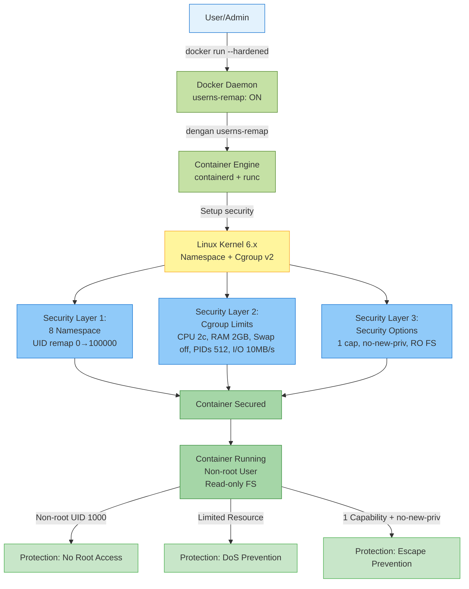

```mermaid
flowchart TD
    A[User/Admin]
    B[Docker Daemon<br/>userns-remap: ON]
    C[Container Engine<br/>containerd + runc]
    D[Container Secured]
    E[Security Layer 1:<br/>8 Namespace<br/>UID remap 0→100000]
    F[Security Layer 2:<br/>Cgroup Limits<br/>CPU 2c, RAM 2GB, Swap off, PIDs 512, I/O 10MB/s]
    G[Security Layer 3:<br/>Security Options<br/>1 cap, no-new-priv, RO FS]
    H[Linux Kernel 6.x<br/>Namespace + Cgroup v2]
    I[Container Running<br/>Non-root User<br/>Read-only FS]
    J[Protection: No Root Access]
    K[Protection: DoS Prevention]
    L[Protection: Escape Prevention]

    A -->|docker run --hardened| B
    B -->|dengan userns-remap| C
    C -->|Setup security| H
    
    H --> E
    H --> F
    H --> G
    
    E --> D
    F --> D
    G --> D
    
    D --> I
    
    I -->|Non-root UID 1000| J
    I -->|Limited Resource| K
    I -->|1 Capability + no-new-priv| L

    style A fill:#e3f2fd,stroke:#1976d2
    style B fill:#c5e1a5,stroke:#558b2f
    style C fill:#c5e1a5,stroke:#558b2f
    style H fill:#fff59d,stroke:#f9a825
    
    style E fill:#90caf9,stroke:#1976d2
    style F fill:#90caf9,stroke:#1976d2
    style G fill:#90caf9,stroke:#1976d2
    
    style D fill:#a5d6a7,stroke:#388e3c
    style I fill:#a5d6a7,stroke:#388e3c
    
    style J fill:#c8e6c9,stroke:#4caf50
    style K fill:#c8e6c9,stroke:#4caf50
    style L fill:#c8e6c9,stroke:#4caf50
```
