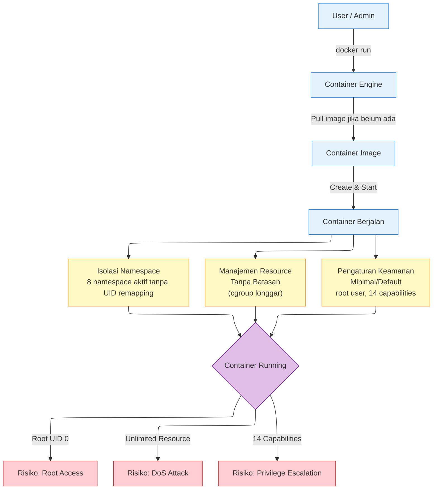
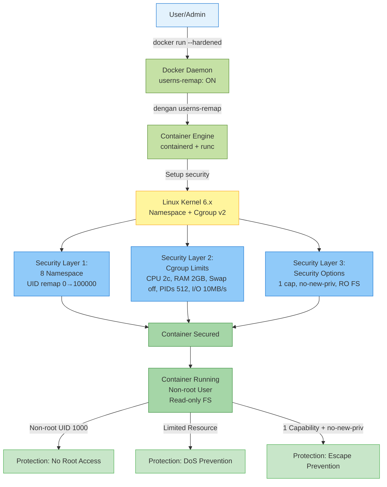
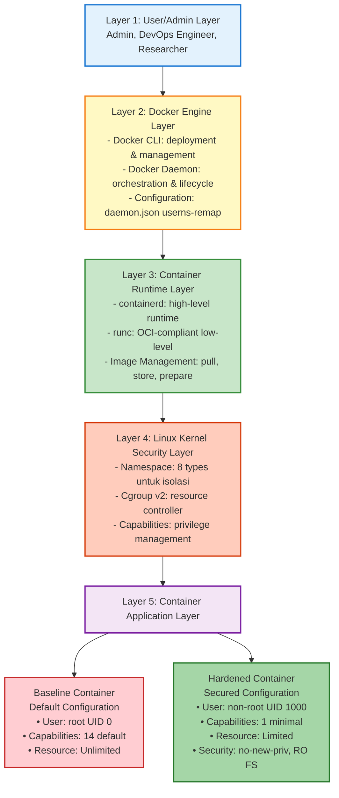

# BAB III
# METODOLOGI DAN PERANCANGAN SISTEM

## 3.1 Pendekatan Penelitian

Penelitian ini menggunakan pendekatan eksperimental komparatif dengan membandingkan dua skenario konfigurasi container untuk mengevaluasi efektivitas penguatan keamanan dan dampaknya terhadap performa sistem. Pendekatan ini melibatkan dua environment terpisah dengan spesifikasi identik untuk memastikan fair comparison dalam testing layer defense-in-depth secara lengkap.

**Dua konfigurasi yang dibandingkan:**

1. **Baseline Configuration (Konfigurasi Default)**

   Konfigurasi Docker default tanpa penguatan keamanan tambahan, di-deploy pada environment terpisah tanpa daemon.json. Container berjalan dengan karakteristik berikut:
   - 8 namespace aktif tanpa user namespace remapping (UID 0 container = UID 0 host, true root)
   - Tidak ada resource limits (CPU, memory, swap, PIDs, I/O unlimited)
   - Security options minimal (root user, 14 default capabilities, filesystem read-write)

2. **Hardened Configuration (Konfigurasi yang Diperkuat)**

   Konfigurasi Docker dengan penerapan pendekatan defense-in-depth melalui multiple security layers, di-deploy pada environment terpisah dengan daemon.json userns-remap. Container berjalan dengan karakteristik berikut:
   - **Isolasi Namespace Lengkap:** 8 namespace aktif dengan user namespace remapping (UID 0 container → UID 100000 host)
   - **Resource Limits Enforcement:** Cgroup v2 untuk membatasi CPU (2.0 cores), memory (2GB), swap (disabled), PIDs (512 processes), dan I/O throughput (10 MB/s read/write)
   - **Security Options:** Capabilities reduction (14 → 1), non-root execution (UID 1000), no-new-privileges flag, read-only root filesystem

Tujuan utama pendekatan ini adalah menganalisis dan mengimplementasikan konfigurasi namespace dan cgroup untuk penguatan isolasi keamanan container Docker melalui pendekatan defense-in-depth, dengan mengukur efektivitas isolasi keamanan, peningkatan postur keamanan berdasarkan CIS Docker Benchmark, serta overhead performa untuk menentukan kelayakan deployment production.

---

## 3.2 Lingkungan dan Kebutuhan Penelitian

Penelitian ini memerlukan spesifikasi sistem dan perangkat lunak tertentu untuk memastikan pengujian dapat dilakukan secara akurat dan reproducible. Bagian ini menjelaskan kebutuhan fungsional dan non-fungsional penelitian, serta spesifikasi perangkat keras, perangkat lunak, dan tools pengujian yang digunakan dalam eksperimen komparatif antara baseline dan hardened configuration.

### 3.2.1 Kebutuhan Fungsional

Sistem penelitian harus memenuhi kebutuhan fungsional berikut:

1. Melakukan deployment container dalam dua mode: baseline (Docker default) dan hardened (dengan penguatan keamanan).

2. Mengaktifkan dan mengonfigurasi 8 namespace dengan user namespace remapping pada konfigurasi hardened.

3. Menerapkan resource limits menggunakan cgroup v2 untuk CPU, memory, swap, PIDs, dan I/O throughput.

4. Mengimplementasikan security options meliputi capabilities reduction, no-new-privileges flag, dan read-only filesystem.

5. Melakukan validasi isolasi namespace dan enforcement resource limits melalui simulasi resource abuse.

6. Menjalankan audit kepatuhan CIS Docker Benchmark v1.6.0 secara otomatis.

7. Mengukur metrik performa meliputi CPU overhead, memory overhead, container startup time, dan HTTP latency.

8. Menghasilkan laporan komparatif antara baseline dan hardened configuration.

### 3.2.2 Kebutuhan Non-Fungsional

Sistem penelitian harus memenuhi kriteria non-fungsional berikut:

1. **Keamanan:**
   - Environment testing terisolasi dari jaringan production
   - Container tidak boleh mempengaruhi stabilitas sistem host
   - Implementasi hardening harus mencapai kepatuhan CIS Benchmark ≥80%

2. **Kinerja:**
   - Overhead performa dari hardening ≤10% untuk CPU dan memory
   - Peningkatan container startup time ≤2 detik
   - Hasil pengujian konsisten dengan variasi <5% antar runs

3. **Reliabilitas:**
   - Testing environment stabil dan dapat di-reset ke kondisi awal
   - Setiap pengujian dijalankan minimal 10 runs untuk konsistensi statistik
   - Dokumentasi lengkap untuk reproducibility penelitian

### 3.2.3 Spesifikasi Sistem Penelitian

Penelitian ini menggunakan spesifikasi perangkat keras, perangkat lunak, dan tools pengujian yang memadai untuk menjalankan eksperimen komparatif antara baseline dan hardened configuration. Spesifikasi lengkap sistem penelitian dijelaskan dalam tabel-tabel berikut.

**Tabel 3.1: Spesifikasi Perangkat Keras**

| Komponen | Requirement Minimal | Keterangan |
|----------|---------------------|------------|
| CPU | 4 cores atau lebih | Untuk menjalankan stress test paralel |
| RAM | 4GB atau lebih | Untuk deployment container dengan resource limits |
| Storage | 50GB SSD | Untuk menyimpan Docker images dan logs pengujian |

**Tabel 3.2: Spesifikasi Perangkat Lunak**

| Komponen | Requirement Minimal | Keterangan |
|----------|---------------------|------------|
| Operating System | Linux distro dengan kernel 5.x atau lebih baru | Dukungan cgroup v2 dan namespace |
| Docker Engine | v20.10 atau lebih baru | Dukungan user namespace remapping |
| Container Runtime | containerd v1.6+ dan runc v1.0+ | OCI-compliant runtime |

Sistem operasi Linux dengan kernel 5.x atau lebih baru diperlukan untuk dukungan penuh cgroup v2 dan namespace (termasuk user namespace remapping). Docker Engine v20.10 atau lebih baru diperlukan untuk mendukung fitur user namespace remapping.

**Tabel 3.3: Tools Pengujian**

| Tool | Versi | Fungsi | Referensi |
|------|-------|--------|-----------|
| docker-bench-security | Latest (2024) | Audit kepatuhan CIS Docker Benchmark v1.6.0 | Docker Inc. |
| stress-ng | v0.17 | Simulasi resource abuse (CPU, memory, PIDs) | GitHub (ColinIanKing/stress-ng) |
| sysbench | v1.0.20 | Benchmark performa CPU dan memory | MySQL/MariaDB Foundation |
| Apache Bench (ab) | v2.3 | Pengujian performa HTTP | Apache HTTP Server Project |
| lsns | v2.39 | Inspeksi namespace Linux | util-linux package |

Tools pengujian dipilih berdasarkan standar industri dan penggunaan luas dalam penelitian keamanan container. docker-bench-security merupakan tools resmi dari Docker Inc. untuk audit CIS compliance, sedangkan stress-ng, sysbench, dan Apache Bench merupakan benchmark tools yang telah tervalidasi dan banyak digunakan dalam penelitian akademis.

---

## 3.3 Analisis Sistem Berjalan

Analisis sistem berjalan bertujuan untuk memahami bagaimana proses deployment container dilakukan dengan konfigurasi default Docker, serta mengidentifikasi kelemahan keamanan yang ada.

### 3.3.1 Diagram Alur Sistem Berjalan

Sistem berjalan menggunakan konfigurasi Docker default tanpa penguatan keamanan tambahan. Alur proses deployment dimulai dari user yang menjalankan perintah `docker run` untuk deploy container aplikasi.

**Gambar 3.2: Flowchart Sistem Berjalan**



Berdasarkan Gambar 3.2, alur proses deployment pada sistem berjalan dimulai dari user yang menjalankan perintah `docker run` untuk deploy container aplikasi.

Container Engine kemudian melakukan pull image dari registry jika belum tersedia di lokal, lalu membuat dan menjalankan container dari image tersebut. Pada tahap ini, tiga aspek konfigurasi diterapkan secara default:
- **Isolasi Namespace:** 8 namespace aktif (time, user, mnt, uts, ipc, pid, cgroup, net) namun user namespace tanpa remapping
- **Manajemen Resource:** Tidak ada batasan pada CPU, memory, swap, PIDs, dan I/O (unlimited)
- **Pengaturan Keamanan:** Security options bersifat default dan minimal

Container yang berjalan dengan konfigurasi default ini menimbulkan tiga risiko utama:
- **Root access:** Container UID 0 = host context UID 0
- **DoS attack:** Resource unlimited dapat exhaust host
- **Privilege escalation:** 14 capabilities membuka attack surface luas

### 3.3.2 Identifikasi Masalah Keamanan

Berdasarkan analisis sistem berjalan, teridentifikasi beberapa masalah keamanan kritis pada konfigurasi default Docker.

**Tabel 3.4: Identifikasi Masalah Keamanan Sistem Berjalan**

| No | Aspek | Kondisi Default | Risiko Keamanan | Dampak Potensial |
|----|-------|-----------------|-----------------|------------------|
| 1 | Isolasi Namespace | 8/8 aktif tanpa user namespace remapping | Privilege escalation dan akses sistem host | UID 0 container = UID 0 host context, jika terjadi namespace escape maka attacker dapat akses host |
| 2 | Manajemen Resource | Unlimited (No cgroup limits) | Potensi DoS melalui resource exhaustion | Proses berlebih dapat habiskan CPU/RAM host dan ganggu stabilitas sistem |
| 3 | Pengaturan Keamanan | Minimal/Optional (14 default capabilities) | Container escape mungkin terjadi | Capability berlebih seperti CAP_SYS_ADMIN dapat dieksploitasi untuk breakout |
| 4 | User Context | Root (UID 0) | Blast radius luas jika terjadi compromise | Aplikasi memiliki privilege penuh dalam container |
| 5 | Filesystem | Read-Write root FS | Malware persistence | Attacker dapat modifikasi binary dan config files |

Berdasarkan Tabel 3.4, sistem berjalan memiliki tiga kelemahan utama yang saling berkaitan. Pertama, meskipun 8 namespace telah aktif, tidak adanya user namespace remapping menyebabkan root privilege (UID 0) di dalam container memiliki mapping yang sama dengan host context, sehingga jika terjadi namespace escape, attacker berpotensi mendapatkan akses root ke host. Kedua, tidak adanya resource limits melalui cgroup memungkinkan terjadinya resource exhaustion attack yang mengancam availability sistem. Ketiga, security options minimal dengan 14 capabilities aktif memperluas attack surface untuk privilege escalation dan container escape.

Kondisi ini menunjukkan bahwa implementasi keamanan belum menerapkan prinsip least privilege dan defense-in-depth secara optimal, sehingga diperlukan penguatan konfigurasi berlapis sebagaimana diusulkan pada Section 3.4.

---

## 3.4 Analisis Sistem Usulan

Berdasarkan identifikasi masalah pada sistem berjalan, dirancang sistem usulan dengan konfigurasi hardened yang menerapkan pendekatan defense-in-depth melalui multiple security layers.

### 3.4.1 Diagram Alur Sistem Usulan

Sistem usulan menerapkan konfigurasi hardened dengan penguatan keamanan berlapis untuk mengatasi kelemahan pada sistem berjalan.

**Gambar 3.3: Flowchart Sistem Usulan**



Berdasarkan Gambar 3.3, alur proses sistem usulan dimulai dari user yang menjalankan perintah `docker run` dengan parameter hardening. Docker Engine kemudian memproses request melalui Docker Daemon dengan konfigurasi userns-remap aktif dan containerd + runc sebagai runtime dengan security options.

Pada tahap deployment, Linux Kernel menerapkan tiga layer keamanan secara berurutan:
- **Layer 1 - Namespace:** 8/8 aktif dengan User Namespace UID remapping (0 → 100000)
- **Layer 2 - Cgroup Limits:** CPU 2 cores, memory 2GB, swap disabled, PIDs 512, I/O 10 MB/s dibatasi secara ketat
- **Layer 3 - Security Options:** Capabilities reduction (14 → 1), no-new-privileges flag, read-only filesystem

Linux kernel 6.x dengan dukungan Namespace dan Cgroup v2 melakukan enforcement terhadap konfigurasi tersebut, sehingga container berjalan dengan non-root user (UID 1000) dan read-only filesystem. Implementasi ini menghasilkan tiga perbaikan keamanan utama: (1) No Root Access melalui isolasi UID (container UID 0 = host UID 100000, aplikasi UID 1000), (2) DoS Prevention melalui limited resource yang mencegah resource exhaustion, dan (3) Escape Prevention melalui defense-in-depth (Namespace + Capabilities + Security Options)

### 3.4.2 Perbandingan Sistem Berjalan vs Sistem Usulan

Perbandingan komprehensif menunjukkan peningkatan signifikan pada sistem usulan.

**Tabel 3.5: Perbandingan Sistem Berjalan vs Sistem Usulan**

| Aspek | Sistem Berjalan (Baseline) | Sistem Usulan (Hardened) | Perbaikan |
|-------|----------------------------|--------------------------|-----------|
| **Deployment** | `docker run node-app` | `docker run --hardened` dengan parameter keamanan | ✅ Penerapan keamanan secara eksplisit |
| **User Namespace** | 8/8 aktif tanpa remapping | 8/8 aktif dengan UID remapping (0→100000) | ✅ Isolasi privilege level host |
| **Application User** | root (UID 0) | non-root (UID 1000) | ✅ Penerapan prinsip least privilege |
| **CPU Limit** | Unlimited | 2.0 cores (enforced) | ✅ Pencegahan CPU exhaustion |
| **Memory Limit** | Unlimited | 2GB enforced dengan OOM killer | ✅ Pencegahan memory bomb |
| **PIDs Limit** | Unlimited | 512 (enforced) | ✅ Pencegahan process exhaustion |
| **I/O Throughput** | Unlimited | 10 MB/s (enforced) | ✅ Pencegahan I/O abuse |
| **Capabilities** | 14 (default) | 1 minimal (NET_BIND_SERVICE) | ✅ Pengurangan attack surface 93% |
| **Security Opt** | Tidak ada | no-new-privileges:true | ✅ Pemblokiran akuisisi privilege |
| **Root Filesystem** | Read-Write | Read-Only + tmpfs /tmp | ✅ Pencegahan modifikasi sistem |
| **Strategi Pertahanan** | Satu lapis (namespace saja) | Berlapis (namespace + cgroup + security options) | ✅ Pendekatan defense-in-depth |
| **Kepatuhan CIS** | ~50-60% | ~80-85% | ✅ Peningkatan kepatuhan +30-35% |
| **Tingkat Risiko** | ⚠️ Tinggi (3 risiko mayor) | ✅ Rendah (3 proteksi aktif) | ✅ Pengurangan risiko signifikan |

Berdasarkan perbandingan pada Tabel 3.5, sistem usulan menerapkan strategi defense-in-depth dengan tiga layer proteksi independen:

1. **User Privilege Layer:** Dual protection melalui user namespace remapping (0→100000 di host) dan non-root execution (UID 1000 di container) untuk mengurangi blast radius jika terjadi compromise.

2. **Resource Limits Layer:** Cgroup v2 enforcement untuk mencegah resource exhaustion attacks yang dapat mempengaruhi availability sistem host dan container lain.

3. **Security Options Layer:** Kombinasi capabilities reduction (93% attack surface reduction), no-new-privileges flag (blocking privilege acquisition), dan read-only filesystem (preventing malware persistence) untuk defense-in-depth terhadap privilege escalation dan system tampering.

Pendekatan berlapis ini memastikan bahwa jika satu layer gagal (misalnya namespace escape), layer lain tetap memberikan proteksi, meningkatkan resilience keamanan container secara keseluruhan.

---

## 3.5 Analisis Konfigurasi

Analisis konfigurasi dilakukan untuk memahami detail teknis perbedaan antara baseline dan hardened configuration.

### 3.5.1 Analisis Baseline Configuration

Baseline configuration menggunakan pengaturan default Docker yang mengaktifkan 8 namespace untuk isolasi dasar. Namun, **user namespace remapping tidak aktif**, menyebabkan UID 0 (root) di dalam container memiliki **UID 0 (true root) pada host system** - memberikan full root privilege jika terjadi container breakout. Konfigurasi default juga tidak menerapkan resource limits, sehingga container dapat mengkonsumsi CPU, memory, swap, PIDs, dan I/O throughput tanpa batasan. Security options bersifat minimal dengan 14 default capabilities aktif, tidak ada no-new-privileges flag, filesystem read-write, dan aplikasi berjalan sebagai root.

**Tabel 3.6: Karakteristik Baseline Configuration**

| Aspek | Konfigurasi | Risiko Keamanan |
|-------|-------------|-----------------|
| Namespace Aktif | 8/8 (tanpa UID remapping) | UID 0 container = UID 0 host (true root) |
| User Privilege | root (UID 0) | Akses root penuh pada host jika breakout |
| CPU Limit | Unlimited | Kemungkinan resource exhaustion |
| Memory Limit | Unlimited | Risiko OOM pada host |
| Swap Limit | Enabled (unlimited) | Risiko penyalahgunaan memory swap |
| PIDs Limit | Unlimited | Kemungkinan serangan process exhaustion |
| I/O Throughput | Unlimited | Kemungkinan serangan I/O starvation |
| Capabilities | 14 default | Attack surface luas |
| Security Opt | None | Akuisisi privilege diizinkan |
| Root Filesystem | Read-Write | Kemungkinan persistensi malware |

### 3.5.2 Analisis Hardened Configuration

Hardened configuration menerapkan pendekatan defense-in-depth dengan multiple security layers. User namespace remapping dikonfigurasi pada daemon level untuk memetakan UID 0 container ke UID 100000 di host, memastikan privilege escalation di dalam container tidak memberikan root access ke host. Aplikasi dijalankan sebagai non-root user (UID 1000) untuk menerapkan prinsip least privilege. Cgroup v2 digunakan untuk enforce resource limits yang ketat (CPU 2 cores, Memory 2GB, Swap disabled, PIDs 512, I/O 10 MB/s). Security options diterapkan secara ketat dengan capabilities reduction (14 → 1), no-new-privileges flag untuk memblokir privilege acquisition, dan read-only root filesystem dengan writable /tmp via tmpfs.

**Tabel 3.7: Karakteristik Hardened Configuration**

| Aspek | Konfigurasi | Proteksi Keamanan |
|-------|-------------|-------------------|
| Namespace Aktif | 8/8 (dengan UID remapping 0→100000) | Isolasi host lengkap |
| User Privilege | non-root (UID 1000) | Least privilege diterapkan |
| CPU Limit | 2.0 cores (enforced) | Pencegahan DoS |
| Memory Limit | 2GB (OOM enforced) | Memory bomb diblokir |
| Swap Limit | Disabled | Pencegahan penyalahgunaan memory swap |
| PIDs Limit | 512 processes (enforced) | Fork bomb dicegah |
| I/O Throughput | 10 MB/s (enforced) | I/O starvation dicegah |
| Capabilities | 1 (NET_BIND_SERVICE) | Attack surface minimal (pengurangan 93%) |
| Security Opt | no-new-privileges:true | Privilege escalation diblokir |
| Root Filesystem | Read-Only + tmpfs /tmp | Pencegahan tampering |

### 3.5.3 Perbandingan Konfigurasi Detail

Perbandingan detail konfigurasi teknis antara baseline dan hardened configuration.

**Tabel 3.8: Perbandingan Detail Konfigurasi**

| Aspek | Baseline | Hardened | Peningkatan |
|-------|----------|----------|-------------|
| User Namespace Remapping | Disabled (UID 0 = true root on host) | Enabled (0→100000) | ✅ Isolasi privilege host |
| Application User | root (UID 0) | non-root (UID 1000) | ✅ Prinsip least privilege |
| CPU Limit | Unlimited | 2.0 cores enforced | ✅ Pencegahan CPU exhaustion |
| Memory Limit | Unlimited | 2GB enforced | ✅ Pencegahan memory bomb |
| Swap | Enabled (unlimited) | Disabled | ✅ Pencegahan penyalahgunaan memory swap |
| PIDs Limit | Unlimited | 512 enforced | ✅ Pencegahan process exhaustion |
| I/O Throughput | Unlimited | 10 MB/s enforced | ✅ Pencegahan penyalahgunaan I/O |
| Capabilities Count | 14 default | 1 minimal | ✅ Pengurangan attack surface 93% |
| Security Opt | None | no-new-privileges | ✅ Akuisisi privilege diblokir |
| Root Filesystem | Read-Write | Read-Only | ✅ Pencegahan tampering sistem |
| CIS Compliance (estimasi) | ~50-60% | ~80-85% | ✅ Peningkatan compliance +30-35% |

Dari Tabel 3.8, terlihat bahwa hardened configuration menerapkan tiga layer proteksi independen: (1) User Privilege Layer dengan dual protection melalui user namespace remapping dan non-root execution, (2) Resource Limits Layer dengan cgroup enforcement untuk mencegah resource exhaustion, dan (3) Security Options Layer dengan kombinasi capabilities reduction, no-new-privileges flag, dan read-only filesystem untuk defense-in-depth terhadap privilege escalation dan system tampering.

---

## 3.6 Perancangan Penelitian

Perancangan penelitian mencakup desain environment eksperimen, use case diagram, activity diagram, dan sequence diagram untuk memastikan proses penelitian dapat dilakukan secara sistematis dan reproducible.

### 3.6.1 Arsitektur Environment Penelitian

Environment penelitian dirancang dengan arsitektur berlapis yang mencerminkan stack teknologi container modern, terdiri dari lima layer utama yang berinteraksi untuk menyediakan isolasi dan keamanan container.

**Gambar 3.4: Arsitektur Environment Penelitian**



Arsitektur environment pada Gambar 3.4 menggambarkan interaksi lima layer utama dalam penelitian ini. Layer 1 (User/Admin) menyediakan interface untuk deployment dan monitoring kedua konfigurasi. Layer 2 (Docker Engine) mengelola lifecycle container dan menerapkan konfigurasi dari daemon.json (userns-remap untuk hardened). Layer 3 (Container Runtime) melakukan low-level operations sesuai OCI specification melalui containerd dan runc. Layer 4 (Linux Kernel) menyediakan mekanisme isolasi fundamental melalui namespace, cgroup v2, dan capabilities. Layer 5 (Container Application) merupakan subjek penelitian yang menjalankan aplikasi test dalam dua konfigurasi berbeda (baseline vs hardened) untuk evaluasi komparatif keamanan dan performa.

### 3.6.2 Use Case Diagram

Use case diagram menggambarkan interaksi antara aktor (Admin/DevOps Engineer) dalam melakukan penelitian komparasi keamanan container.

**Gambar 3.5: Diagram Use Case - Penelitian Komparasi Keamanan Container Docker**

```
Lihat file: usecase.puml
Untuk generate image: plantuml usecase.puml
```

Diagram use case pada Gambar 3.5 menggambarkan interaksi Admin/DevOps Engineer dengan sepuluh use case penelitian yang mencakup deployment, testing, validation, monitoring, dan reporting:

**A. Deployment Configuration:**
- **UC1 - Deploy Container Baseline:** Deployment container dengan konfigurasi default Docker
- **UC2 - Deploy Container Hardened:** Deployment container yang diperkuat (include UC3, UC4, UC5)
  - **UC3 - Konfigurasi Isolasi Namespace:** Setup 8 namespace dengan UID remapping (0→100000)
  - **UC4 - Konfigurasi Batasan Cgroup:** Enforce resource limits (CPU, memory, swap, PIDs, I/O throughput)
  - **UC5 - Terapkan Security Options:** Implementasi security options (capabilities reduction, non-root user execution, no-new-privileges flag, read-only filesystem, secure tmpfs mount)

**B. Testing & Validation:**
- **UC6 - Uji Enforcement Cgroup:** Validasi cgroup enforcement menggunakan stress-ng (CPU, memory, PIDs) dan I/O throughput test
- **UC7 - Uji Performa Container:** Pengukuran overhead performa menggunakan Apache Bench, sysbench, dan startup time measurement
- **UC8 - Audit Kepatuhan CIS Benchmark:** Validasi compliance terhadap CIS Docker Benchmark v1.6.0 (target ≥80%)

**C. Monitoring & Reporting:**
- **UC9 - Pantau Resource Container:** Monitor resource usage container secara real-time menggunakan docker stats
- **UC10 - Generate Laporan Komparatif:** Generate analisis komparatif antara baseline dan hardened configuration

### 3.6.3 Activity Diagram

Activity diagram menggambarkan alur proses deployment untuk baseline dan hardened configuration.

**Gambar 3.6: Activity Diagram - Baseline Configuration**

```
Lihat file: activity-baseline.puml
Untuk generate image: plantuml activity-baseline.puml
```

Diagram aktivitas baseline pada Gambar 3.6 menunjukkan alur dimana User/Admin menjalankan `docker run node-test-app`, kemudian Docker Engine melakukan pull dan validasi image, Linux Kernel mengaktivasi 8 namespace tanpa UID remapping, tidak ada resource limits diterapkan, security menggunakan konfigurasi default (root, 14 caps, RW FS), sehingga container berjalan dengan risiko keamanan tinggi.

**Gambar 3.7: Activity Diagram - Hardened Configuration**

```
Lihat file: activity-hardened.puml
Untuk generate image: plantuml activity-hardened.puml
```

Diagram aktivitas hardened pada Gambar 3.7 menunjukkan alur yang lebih kompleks dimana User/Admin menjalankan `docker run node-test-app` dengan security flags, Docker Engine melakukan pull dan validasi, Linux Kernel mengaktivasi 8 namespace dengan UID remapping (0→100000), resource limits di-enforce (CPU 2c, RAM 2GB, Swap disabled, PIDs 512, I/O 10MB/s), security options di-enforce (non-root, 1 cap, RO FS), container terproteksi dijalankan, kemudian dilakukan audit CIS Benchmark untuk memastikan compliance score ≥80%, jika belum tercapai maka dilakukan penyesuaian konfigurasi.

### 3.6.4 Sequence Diagram

Sequence diagram menggambarkan interaksi detail antar komponen sistem dalam urutan waktu.

**Gambar 3.8: Sequence Diagram - Deploy Hardened Container (UC2)**

```
Lihat file: sequence-deploy.puml
Untuk generate image: plantuml sequence-deploy.puml
```

Sequence diagram pada Gambar 3.8 menggambarkan interaksi dalam menjalankan container yang diperkuat dimana Admin/DevOps menjalankan `docker run node-test-app` dengan security flags melalui Docker CLI, kemudian Docker Daemon dan containerd berinteraksi dengan Linux Kernel untuk melakukan konfigurasi berurutan: (1) UC3 - Konfigurasi 8 namespace dengan UID remapping (0→100000), (2) UC4 - Terapkan cgroup limits (CPU 2c, RAM 2GB, Swap disabled, PIDs 512, I/O 10MB/s), (3) UC5 - Terapkan security options (caps drop, non-root, read-only), kemudian containerd memulai container yang sudah diamankan dan mengirim response berhasil ke Admin/DevOps.

**Gambar 3.9: Sequence Diagram - Validasi CIS Benchmark (UC8)**

```
Lihat file: sequence-validation.puml
Untuk generate image: plantuml sequence-validation.puml
```

Sequence diagram pada Gambar 3.9 menggambarkan proses validasi CIS Benchmark dimana Admin/DevOps menjalankan docker-bench-security yang melakukan UC6 (Query konfigurasi Daemon, Inspeksi Container, Validasi namespace/limits/security options), hasil query dibandingkan dengan CIS Benchmark v1.6.0, compliance score dihitung, dan menghasilkan laporan dengan status COMPLIANT jika ≥80% atau NON-COMPLIANT jika <80% disertai rekomendasi perbaikan.

---

## 3.7 Rancangan Konfigurasi

Rancangan konfigurasi menjelaskan spesifikasi teknis detail untuk implementasi hardened container. Konfigurasi dibagi menjadi tiga komponen utama yang saling melengkapi dalam pendekatan defense-in-depth: (1) **Namespace Configuration** untuk isolasi resource sistem, (2) **Cgroup Configuration** untuk enforcement resource limits, dan (3) **Security Options Configuration** untuk capabilities reduction dan filesystem protection. Setiap komponen dirancang berdasarkan standar CIS Docker Benchmark v1.6.0 dan best practices container security untuk memastikan postur keamanan yang kuat dengan overhead performa minimal.

### 3.7.1 Namespace Configuration

Konfigurasi 8 namespace untuk isolasi process, network, filesystem, dan user.

**Tabel 3.9: Spesifikasi Namespace Configuration**

| Namespace | Fungsi | Baseline | Hardened |
|-----------|--------|----------|----------|
| time | Isolasi system clock | Aktif | Aktif |
| user | Isolasi UID/GID mapping | Aktif (no remap) | Aktif (0→100000) |
| mnt | Isolasi filesystem mounts | Aktif | Aktif (read-only) |
| uts | Isolasi hostname | Aktif | Aktif |
| ipc | Isolasi inter-process communication | Aktif | Aktif |
| pid | Isolasi process ID space | Aktif | Aktif |
| cgroup | Isolasi cgroup hierarchy | Aktif | Aktif |
| net | Isolasi network stack | Aktif | Aktif |

### 3.7.2 Cgroup Configuration

Konfigurasi cgroup v2 untuk resource limits enforcement. Resource limits mencakup CPU, memory, swap, PIDs, dan I/O throughput untuk mencegah resource exhaustion dan DoS attacks. Swap disabled (memory.swap.max = 0) untuk mencegah performance degradation akibat memory spill ke disk, sesuai dengan CIS Docker Benchmark 5.17.

**Tabel 3.10: Spesifikasi Cgroup Resource Limits**

| Resource | Baseline | Hardened | Mechanism |
|----------|----------|----------|-----------|
| CPU | Unlimited | 2.0 cores | cpu.max throttling |
| Memory | Unlimited | 2GB | memory.max + OOM killer |
| PIDs | Unlimited | 512 | pids.max limit |
| I/O Read | Unlimited | 10 MB/s | io.max throttle (--device-read-bps) |
| I/O Write | Unlimited | 10 MB/s | io.max throttle (--device-write-bps) |
| Swap | Enabled | Disabled | memory.swap.max = 0 |

### 3.7.3 Security Options Configuration

Konfigurasi security options untuk capabilities, privileges, dan filesystem.

**Tabel 3.11: Spesifikasi Security Options**

| Layer | Baseline | Hardened | Impact |
|-------|----------|----------|--------|
| Capabilities | 14 default | 1 (NET_BIND_SERVICE) | 93% reduction |
| User Context | root (UID 0) | non-root (UID 1000) | Least privilege |
| New Privileges | Allowed | Blocked (no-new-priv) | Escalation prevention |
| Root Filesystem | Read-Write | Read-Only + tmpfs /tmp | Tamper prevention |

---

## 3.8 Metode Pengujian

Metode pengujian dirancang untuk memvalidasi efektivitas konfigurasi hardened terhadap baseline configuration melalui pengukuran variabel keamanan, isolasi, dan performa. Pengujian dilakukan secara sistematis dengan prosedur yang terstruktur dan skenario yang mencakup seluruh aspek penelitian untuk memastikan hasil yang reproducible dan dapat diverifikasi.

### 3.8.1 Variabel Penelitian

Penelitian menggunakan tiga kategori variabel untuk mengukur efektivitas konfigurasi hardened. Setiap kategori memiliki variabel spesifik dengan metrik pengukuran dan target yang jelas untuk memastikan validasi hasil penelitian dapat dilakukan secara objektif.

**Tabel 3.12a: Variabel Keamanan**

| No | Variabel | Metrik Pengukuran | Target/Expected Value |
|----|----------|-------------------|----------------------|
| 1 | CIS Compliance | Skor kepatuhan CIS Benchmark (%) | ≥80% |
| 2 | Capabilities | Jumlah Linux capabilities aktif | 14 → 1 (pengurangan 93%) |
| 3 | User Privilege | UID proses aplikasi | Non-root (UID 1000) |
| 4 | Security Options | Flag no-new-privileges, filesystem mode | Enforced, Read-only |

**Tabel 3.12b: Variabel Isolasi**

| No | Variabel | Metrik Pengukuran | Target/Expected Value |
|----|----------|-------------------|----------------------|
| 1 | Namespace | Jumlah namespace aktif dengan UID remapping | 8/8 namespace (0→100000) |
| 2 | CPU Limit | Enforcement cgroup CPU throttling | 100% (2.0 cores enforced) |
| 3 | Memory Limit | Enforcement cgroup memory limit | 100% (2GB + OOM killer) |
| 4 | PIDs Limit | Enforcement cgroup PIDs limit | 100% (512 processes) |

**Tabel 3.12c: Variabel Performa**

| No | Variabel | Metrik Pengukuran | Target/Expected Value |
|----|----------|-------------------|----------------------|
| 1 | CPU Overhead | Persentase peningkatan CPU usage (%) | ≤10% |
| 2 | Memory Overhead | Persentase peningkatan memory usage (%) | ≤10% |
| 3 | Startup Time | Selisih waktu startup container (detik) | ≤+2 detik |
| 4 | HTTP Latency | Peningkatan response time P95 (milidetik) | ≤+10ms |

### 3.8.2 Prosedur Pengujian

Prosedur pengujian dilakukan secara sistematis untuk memastikan konsistensi dan reproducibility hasil. Pengujian dilakukan dalam tiga tahap utama untuk setiap konfigurasi (baseline dan hardened) dengan metodologi yang identik untuk fair comparison.

**Tahap 1: Deployment dan Validasi Konfigurasi**

Tahap pertama dimulai dengan deployment container menggunakan konfigurasi yang akan diuji (baseline atau hardened). Setelah container berjalan, dilakukan validasi konfigurasi melalui:
- Inspeksi namespace menggunakan `lsns` untuk memverifikasi 8 namespace aktif
- Audit capabilities menggunakan `docker inspect` untuk memverifikasi jumlah capabilities
- Verifikasi user privilege menggunakan `whoami` dan `id` untuk mengonfirmasi UID proses
- Validasi security options (no-new-privileges flag, read-only filesystem)

Pengujian validasi konfigurasi dilakukan **satu kali per deployment** karena bersifat deterministik dan tidak berubah.

**Tahap 2: Pengujian Keamanan dan Isolasi**

Tahap kedua melakukan pengujian keamanan dan enforcement cgroup melalui:
- **Audit CIS Benchmark:** Eksekusi docker-bench-security untuk menghitung compliance score (1x per konfigurasi)
- **Enforcement CPU:** Validasi CPU throttling menggunakan stress-ng dengan 4 workers (3x, ambil median)
- **Enforcement Memory:** Validasi memory limit dengan stress-ng dan OOM killer (3x, ambil median)
- **Enforcement PIDs:** Validasi PIDs limit dengan stress-ng fork test (3x, ambil median)

Pengujian enforcement dilakukan **3 kali pengulangan** untuk memverifikasi konsistensi enforcement.

**Tahap 3: Pengujian Performa**

Tahap ketiga melakukan pengukuran overhead performa dengan tools benchmark standar:
- **HTTP Benchmark:** Apache Bench (ab) dengan 10,000 requests, 50 concurrent (10x, ambil median)
- **CPU Benchmark:** sysbench CPU test dengan max-prime 20,000 (10x, ambil median)
- **Memory Benchmark:** sysbench memory test dengan 10GB total (10x, ambil median)
- **Startup Time:** Pengukuran waktu startup container menggunakan `time` (10x, ambil median)

Pengujian performa dilakukan **10 kali pengulangan** untuk mendapatkan hasil statistik yang akurat karena variasi tinggi pada environment testing.

Setelah pengujian selesai untuk baseline configuration, seluruh prosedur diulang untuk hardened configuration dengan parameter yang identik. Tahap akhir adalah analisis komparatif dengan membandingkan hasil kedua konfigurasi, menghitung overhead performa menggunakan formula `((Hardened - Baseline) / Baseline) × 100%`, dan generate laporan evaluasi komprehensif.

### 3.8.3 Skenario Pengujian

Pengujian dilakukan dalam empat skenario utama untuk menjawab rumusan masalah penelitian.

**Tabel 3.13: Skenario Pengujian**

| Skenario | Deskripsi | Expected Output | Tools |
|----------|-----------|-----------------|-------|
| **Uji Isolasi Namespace** | Validasi 8 namespace aktif dengan ID unik dan UID remapping | Baseline: 8/8 no remap<br>Hardened: 8/8 + remap 0→100000 | lsns, docker inspect |
| **Uji Resource Limits** | Simulasi resource abuse untuk validasi cgroup enforcement | Baseline: unlimited<br>Hardened: limits enforced 100% | stress-ng, sysbench |
| **Uji Defense-in-Depth** | Analisis user privilege, capabilities, security options | Baseline: root, 14 caps<br>Hardened: non-root, 1 cap | docker inspect, whoami |
| **Uji CIS Compliance** | Audit kepatuhan CIS Docker Benchmark | Baseline: ~50-60%<br>Hardened: ≥80% | docker-bench-security |
| **Uji Performa** | Pengukuran CPU, memory, startup time, HTTP latency | Overhead ≤10%<br>Startup ≤+2s | sysbench, Apache Bench |

---

## 3.9 Indikator Keberhasilan

Indikator keberhasilan digunakan untuk mengevaluasi apakah implementasi hardening memenuhi target yang ditetapkan.

**Tabel 3.14: Indikator Keberhasilan Penelitian**

| Indikator | Target | Metode Validasi |
|-----------|--------|-----------------|
| **Skor Kepatuhan CIS** | ≥80% | Audit docker-bench-security |
| **Pengurangan Capabilities** | 14 → 1 (pengurangan 93%) | Inspeksi docker capabilities |
| **Privilege Pengguna** | Non-root (UID 1000) | Command whoami, id |
| **Overhead CPU** | ≤10% | Perbandingan benchmark sysbench CPU |
| **Overhead Memory** | ≤10% | Perbandingan benchmark sysbench memory |
| **Peningkatan Startup Time** | ≤2 detik | Pengukuran time docker-compose up |
| **Latensi HTTP P95** | ≤+10ms | Perbandingan persentil Apache Bench |
| **Enforcement Resource Limits** | 100% (CPU, memory, swap, PIDs, I/O) | Validasi dengan stress-ng |

Hasil penelitian dinyatakan berhasil jika semua indikator keamanan dan isolasi tercapai dengan overhead performa dalam batas acceptable (≤10% untuk CPU/memory, ≤2s startup, ≤+10ms latency).

---

## 3.10 Ringkasan Bab

BAB III telah menjelaskan metodologi penelitian yang mencakup pendekatan eksperimental komparatif, analisis kebutuhan sistem, analisis sistem berjalan (identifikasi masalah keamanan), analisis sistem usulan (strategi perbaikan defense-in-depth), analisis konfigurasi detail, perancangan sistem dengan arsitektur 5 layer dan diagram lengkap (use case, activity, sequence), rancangan konfigurasi teknis (namespace, cgroup, security options), serta metode pengujian dengan variabel, prosedur, skenario, dan indikator keberhasilan yang jelas. Rancangan ini memastikan penelitian dapat menjawab ketiga rumusan masalah secara sistematis, terukur, dan reproducible. BAB IV akan menyajikan implementasi sistem, hasil pengujian, dan analisis komparatif antara baseline dan hardened configuration.

